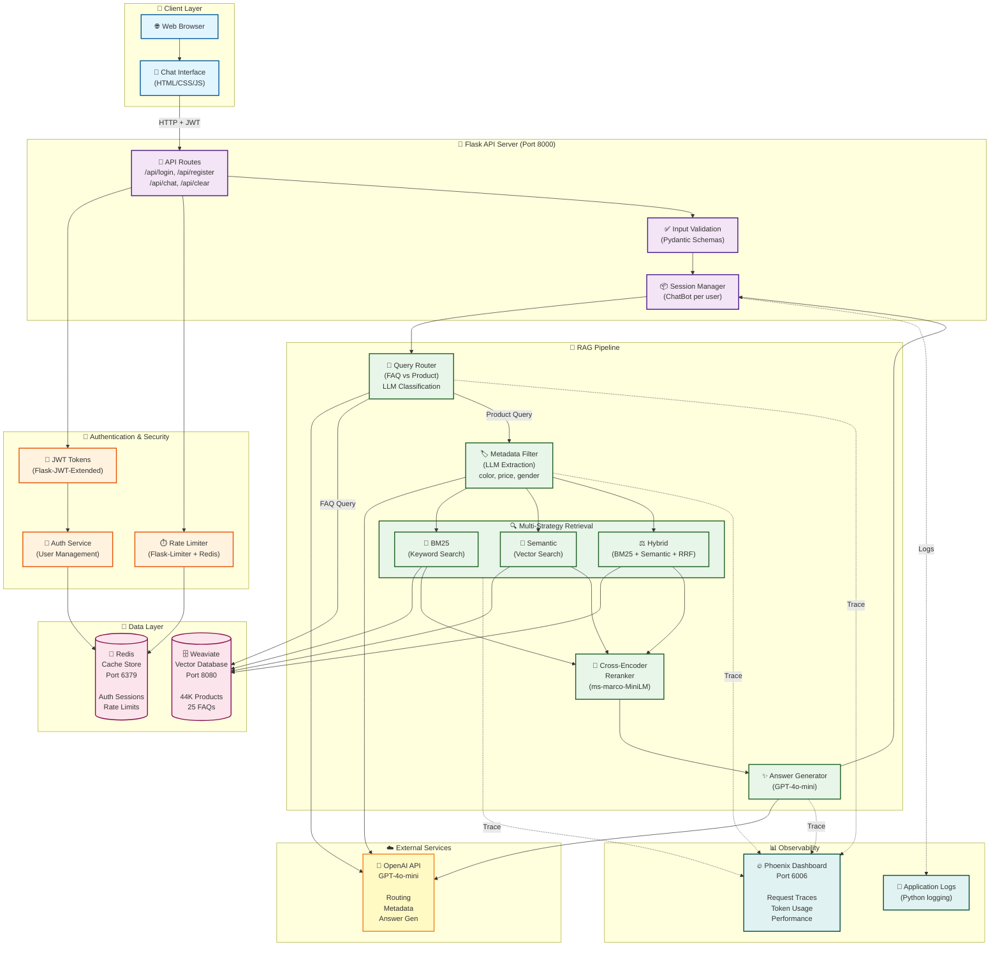
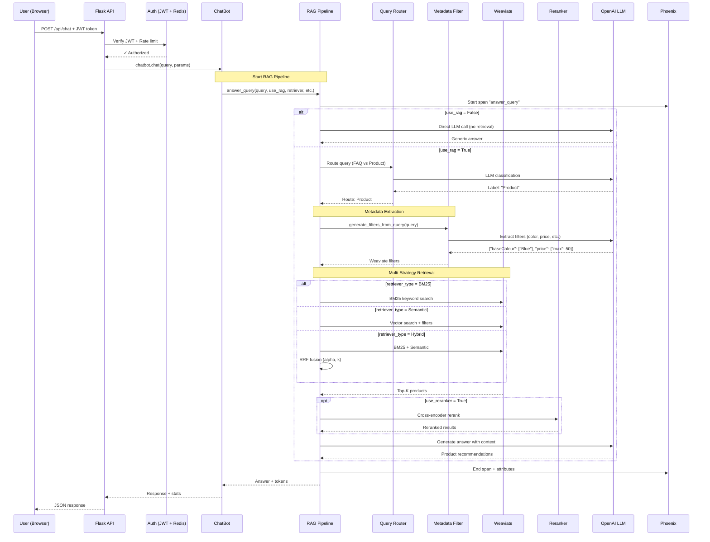

# Fashion Forward Hub - Advanced RAG Chatbot

A production-grade Retrieval-Augmented Generation (RAG) chatbot for fashion e-commerce, featuring multiple retrieval strategies, JWT authentication, comprehensive testing, and full observability.

## 🚀 Key Highlights:

- 📄 **3 Retrieval Strategies:** BM25 (keyword), Semantic (vector), Hybrid (RRF fusion)
- 🧠 **Smart Metadata Filtering:** LLM-powered filter extraction for precise product search
- 🔎 **Cross-Encoder Reranking:**  Enhanced result relevance
- ☁️ **Phoenix Observability:** Full tracing of RAG pipeline
- 💬 **Production Security:** JWT auth + Redis rate limiting
- 🔁 **Comprehensive Testing:** Unit, Integration, Evaluation, Performance tests

  
## 🚀 What This Project Does

- **🛍️ Answers fashion e-commerce queries** using RAG (FAQ + Product search)
- **🧠 Intelligently routes queries** to FAQ or Product databases
- **🔍 Multiple retrieval strategies** - BM25, Semantic, Hybrid with configurable parameters
- **🎯 Metadata filtering** - Extracts filters (color, price, gender, etc.) from natural language
- **📊 Full observability** - Phoenix tracing tracks every step of the pipeline
- **🔐 Production-ready**  - JWT authentication, rate limiting, input validation
- **✅ Quality assured** - RAGAS metrics, performance benchmarks, regression tests


## 🏗️ Architecture Diagram

  

---
## 🏗️ Execution Sequence (End-to-End)


**🏗️ Detailed Architecture Flow**
### 1️⃣ Authentication & Rate Limiting
```bash
User Request
    ↓
JWT Verification (Flask-JWT-Extended)
    ├─ Valid? → Continue
    └─ Invalid? → 401 Unauthorized
    ↓
Rate Limiting (Flask-Limiter + Redis)
    ├─ 20 chat requests/min per user
    ├─ 100 total requests/hour per user
    ├─ 10 login attempts/hour per IP
    └─ 5 register attempts/hour per IP
    ↓
Request proceeds to ChatBot
```
### 2️⃣ Query Routing (FAQ vs Product)
```bash
Query: "What is your return policy?"
    ↓
check_if_faq_or_product(query)
    ↓
LLM Classification (GPT-4o-mini, temp=0)
    ├─ Analyzes query intent
    ├─ Examples-based few-shot
    └─ Output: "FAQ" or "Product"
    ↓
Route to appropriate handler
```
### 3️⃣ Product Retrieval Pipeline
```bash
Query: "blue shirts under $50"
    ↓
Metadata Extraction (if simplified=False)
    ├─ LLM extracts structured filters
    ├─ {"baseColour": ["Blue"], "price": {"max": 50}}
    └─ Convert to Weaviate filters
    ↓
Retrieval Strategy Selection
    ├─ BM25: Keyword-based (TF-IDF)
    ├─ Semantic: Vector similarity + filters
    └─ Hybrid: BM25 + Semantic + RRF fusion
    ↓
Optional Reranking
    ├─ Cross-encoder model
    └─ Reorders by relevance score
    ↓
Top-K Products Retrieved
    ↓
Generate LLM Response
    └─ Context: Product list + metadata
```
### 4️⃣ Hybrid Retrieval (RRF Fusion)
```bash
Reciprocal Rank Fusion (RRF)
    ↓
1. BM25 Search → Results A (keyword match)
2. Semantic Search → Results B (meaning match)
    ↓
3. Score each result:
   score = α/(k + rank_bm25) + (1-α)/(k + rank_semantic)
   
   where:
   - α (alpha): Weight for BM25 (0.0 to 1.0)
   - k: RRF constant (typically 60)
    ↓
4. Sort by combined score
5. Return top-K fused results

Example:
α = 0.5: Equal weight to keyword and semantic
α = 0.8: Favor keyword matching
α = 0.2: Favor semantic similarity
```
---

## 📁 Project Structure
```text
ChatBot/
├── src/                                  # Core application code
│   ├── interface/
│   │   └── web_app.py                   # Flask API (JWT, rate limiting, endpoints)
│   ├── auth.py                          # User authentication service
│   ├── chatbot.py                       # Conversation manager
│   ├── config.py                        # Configuration (env variables)
│   ├── database.py                      # Weaviate client
│   ├── llm.py                           # OpenAI API wrapper
│   ├── metadata_filter.py               # LLM-based filter extraction
│   ├── models.py                        # User model (password hashing)
│   ├── query_router.py                  # FAQ vs Product classification
│   ├── rag_pipeline.py                  # Main RAG orchestration
│   ├── reranker.py                      # Cross-encoder reranking
│   ├── schemas.py                       # Pydantic validation models
│   └── tracer.py                        # Phoenix OpenTelemetry setup
│
├── static/                               # Frontend assets
│   ├── css/
│   │   ├── auth.css                     # Login/register styling
│   │   └── style.css                    # Chat UI styling
│   └── js/
│       ├── auth.js                      # Login/register logic
│       └── chat.js                      # Chat interface logic
│
├── templates/                            # HTML templates
│   ├── index.html                       # Login/register page
│   └── chat.html                        # Chat interface
│
├── tests/                                # Comprehensive test suite
│   ├── conftest.py                      # Pytest fixtures
│   ├── unit/
│   │   └── test_retrieval.py           # BM25, Semantic, Hybrid tests
│   ├── integration/
│   │   └── test_rag_pipeline.py        # End-to-end pipeline tests
│   ├── evaluation/
│   │   ├── test_rag_quality.py         # RAGAS metrics
│   │   └── test_performance.py         # Latency & regression tests
│   └── run_tests.py                    # Test runner script
│
├── data/                                 # Data files (not in repo)
│   ├── clothes.csv                      # Product catalog (44K items)
│   ├── clothes_json.joblib              # Processed product data
│   ├── faq.csv                          # FAQ database
│   └── faq_or_products.csv             # Training data for router
│
├── docker-compose.yml                    # Weaviate + Phoenix + Redis
├── .env                                 # Environment variables
├── .gitignore                           # Git ignore rules
├── pyproject.toml                       # Python dependencies
└── README.md                            # This file
```
---
## 🛠️ Prerequisites

### Required Software
- **Python 3.11+** (recommended via `.python-version`)
- **[`uv`](https://github.com/astral-sh/uv)** – fast Python package & environment manager
- **Docker & Docker Compose (for Weaviate, Phoenix, Redis)**
- **Git**
  
### Required Services:
- **OpenAI API Key (GPT-4o-mini access)**
- **Weaviate (vector database)**
- **Redis (authentication + rate limiting)**
- **Phoenix (observability dashboard)**

### System Requirements:
- **RAM: 8GB minimum (Weaviate + embeddings)**
- **Disk: 5GB for vector indices**
- **CPU: Multi-core recommended for reranking**

---
## ⚙️ Setup Instructions

Follow these steps to run the **Fashion Forward Hub RAG Chatbot** system locally.

---

### 1️⃣ Clone the repository

```bash
git clone https://github.com/AvinashBolleddula/Fashion-Forward-Hub.git
cd fashion-forward-hub-rag
```

### 2️⃣ Create and activate a virtual environment
This project uses uv for fast and reproducible Python environments.
```bash
uv venv
source .venv/bin/activate
```
You should now see (.venv) in your terminal prompt.

### 3️⃣ Install dependencies
Install all required dependencies exactly as defined in pyproject.toml and uv.lock.
```bash
uv sync
```
### 4️⃣ Configure environment variables
Create a .env file inside the weather/ directory:
```bash
# OpenAI Configuration
OPENAI_API_KEY=sk-...
OPENAI_MODEL=gpt-4o-mini

# Weaviate Configuration
WEAVIATE_URL=http://localhost:8080
WEAVIATE_HOST=localhost
WEAVIATE_PORT=8080

# Redis Configuration
REDIS_URL=redis://localhost:6379/0

# Flask Configuration
FLASK_HOST=0.0.0.0
FLASK_PORT=8000
FLASK_DEBUG=True

# JWT Configuration
JWT_SECRET_KEY=your-super-secret-key-change-in-production
JWT_ACCESS_TOKEN_EXPIRES=3600

# Rate Limiting
RATE_LIMIT_DEFAULT=100/hour
RATE_LIMIT_CHAT=20/minute

# Phoenix Configuration (Optional)
PHOENIX_PORT=6006

# Context Window
CONTEXT_WINDOW=10
```

### 5️⃣ Start Docker Services
Start Weaviate, Redis, and Phoenix:
```bash
docker-compose up -d

```
Verify services are running:
```bash
docker-compose ps

```
You should see:

weaviate on port 8080
redis on port 6379
phoenix on port 6006


### 6️⃣  Load Data into Weaviate
Option A: Use Pre-loaded Data (Recommended)
If you have the vector database already populated:

```bash
# Database should persist in ./weaviate-data/
# Just start docker-compose and collections are available
```
Option B: Load Data Manually

```bash
# 1. Ensure data files exist in ./data/
ls data/
# Should show: clothes.csv, faq.csv, clothes_json.joblib, faq_or_products.csv

# 2. Run data loading scripts (if available)
python scripts/load_products.py
python scripts/load_faqs.py
```

### Run the Flask Application
```bash
python src/database.py
```
You should see output similar to:
```bash
INFO:__main__:Starting Flask app on 0.0.0.0:8000
 * Running on http://0.0.0.0:8000
```
Open your browser at:
```bash
http://localhost:8000
```
You'll see the login/register page.

### 6️⃣ Create an Account & Start Chatting
- **1.	Register a new account**
- **2.	Login with your credentials**
- **3.	Start asking questions!**

## Ask questions 🎯
### Example query:

- **“What is your return policy?”**
- **“Show me blue shirts under $50”**
- **“Do you have casual summer wear for men?”**

## 🧪 Testing

Run All Tests

```bash
# Using test runner
python tests/run_tests.py all

# Or using pytest directly
pytest tests/ -v
```

## 📊 Observability (Phoenix Dashboard)

Access Phoenix at: http://localhost:6006

### What You Can Track:

- **Request Traces**
- **Query Routing**
- **Retrieval Performance**
- **LLM Calls**
- **End-to-End Metrics**

Example Trace View
```bash
answer_query (2.8s)
├─ routing_faq_or_product (1.2s)
│  └─ Attributes: {"label": "Product", "tokens": 50}
├─ generate_metadata (1.5s)
│  └─ Attributes: {"filters": 2, "tokens": 1366}
├─ retrieve_semantic (0.8s)
│  └─ Attributes: {"num_results": 15, "has_filters": true}
└─ final_llm_call (0.9s)
   └─ Attributes: {"tokens": 856}
```


## 🚀 Future Enhancements

### Planned Features

- **Caching Layers**
- **Conversation Memory**
- **Advanced Analytics**
- **Multi-Modal Support**
- **Deployment**
- **Enhanced Retrieval**
